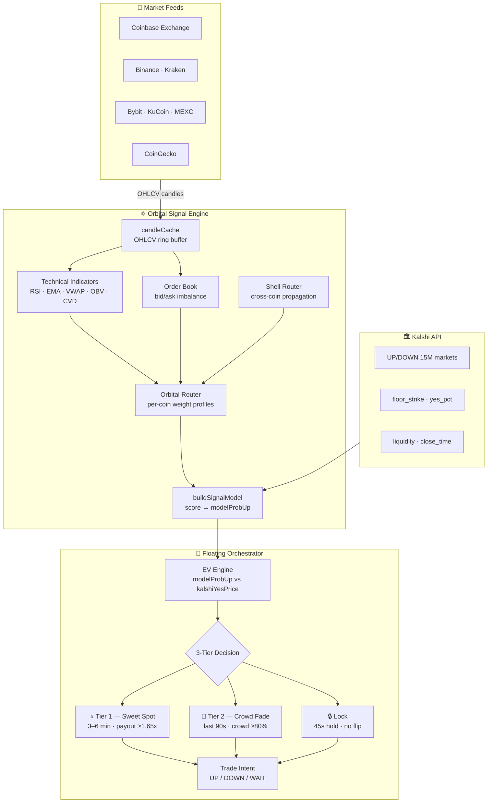
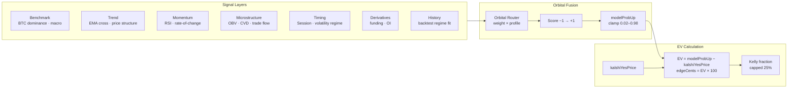
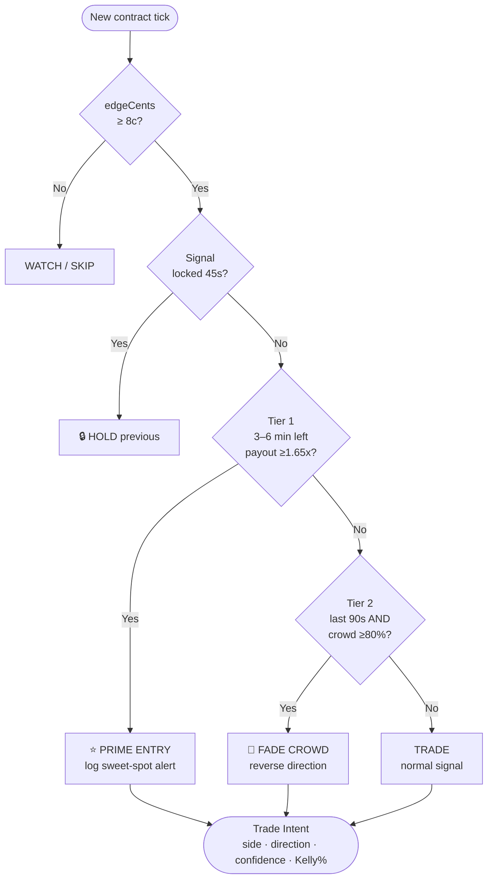
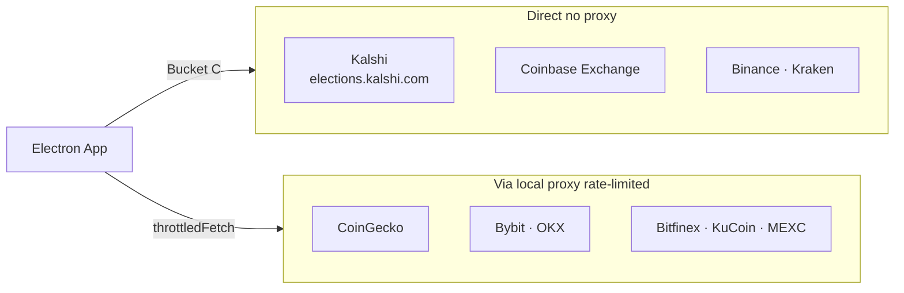

# WE|||CRYPTO

> **Predictions dashboard for Kalshi UP/DOWN crypto binary contracts**
> Built on a subatomic orbital model — signal packets orbit each coin's nucleus, weighted by orbital profile, fused into a single EV-optimised trade intent.


---

## Architecture



---

## Orbital Model

Each coin is assigned an **orbital profile** that weights signal packets before fusion. Based on atomic shell physics — stable nuclei vs reactive outer shells.

| Coin | Profile | Benchmark | Momentum | Timing | Risk Tolerance |
|------|---------|-----------|----------|--------|----------------|
| BTC  | `core`      | ×1.10 | ×0.96 | ×0.78 | Conservative |
| ETH  | `core`      | ×1.10 | ×0.96 | ×0.78 | Conservative |
| BNB  | `core`      | ×1.10 | ×0.96 | ×0.78 | Conservative |
| XRP  | `core`      | ×1.10 | ×0.96 | ×0.78 | Conservative |
| SOL  | `momentum`  | ×0.98 | ×1.08 | ×1.12 | Aggressive   |
| HYPE | `momentum`  | ×0.98 | ×1.08 | ×1.12 | Aggressive   |
| DOGE | `highBeta`  | ×0.98 | ×1.10 | ×1.02 | High-Risk    |

**Shell Router** — when one coin's shell ionises (sell threshold crossed), a signal packet propagates to correlated coins after a configured delay. Momentum coins (SOL/HYPE) amplify shell events ×1.12; core coins (BTC/ETH) absorb them quietly at ×0.78.

---

## Signal Flow



---

## 3-Tier Decision Engine



| Tier | Trigger | Logic |
|------|---------|-------|
| 1 — Sweet Spot | 3–6 min left, payout ≥ 1.65× | Model and Kalshi aligned, good odds, time to fill |
| 2 — Crowd Fade | Last 90s, crowd ≥ 80% one side | Extreme crowd bias → fade (house pricing is wrong) |
| Lock | Signal committed | Hold 45s — prevents signal flip in final minutes |

---

## Alignment States

| State | Meaning | Action |
|-------|---------|--------|
| `ALIGNED` | Model + Kalshi agree direction | Trade if edge ≥ 8¢ |
| `DIVERGENT` | Model disagrees with Kalshi | Inversion — buy cheap side, house mispriced |
| `MODEL_LEADS` | Kalshi ~50/50, model has conviction | Trade if edge ≥ 8¢ |
| `MODEL_ONLY` | No Kalshi data | Trade on model alone |
| `KALSHI_ONLY` | Model below threshold | Watch only |
| `SHELL_EVAL` | Shell wall evaluating (3 ticks) | Hold — collecting data |

---

## Coins

`BTC · ETH · SOL · XRP · DOGE · BNB · HYPE`

All served by Kalshi 15-minute UP/DOWN binary contracts (`KXBTC15M`, `KXETH15M`, etc.).
Price feeds: Coinbase Exchange (BTC/ETH/SOL/XRP/DOGE) · CoinGecko (BNB/HYPE).

---

## API Routing



---

## Stack

| Layer | Technology |
|-------|-----------|
| App shell | Electron 37 — portable `.exe`, no install required |
| UI renderer | Vanilla JS + Canvas (no framework) |
| Signal engine | `predictions.js` — RSI, EMA, VWAP, OBV, CVD, order book |
| Orchestrator | `floating-orchestrator.js` — EV engine, Kelly sizing |
| Market data | `prediction-markets.js` — Kalshi 15M + 5M feeds |
| Cross-coin | `shell-router.js` — orbital propagation |
| API proxy | `proxy-fetch.js` + `throttled-fetch.js` |

---

## Build

```bash
npm install
npm run build
# → dist/WECRYPTO-PATCH-2.1.1.exe   (portable, no install)
```

Kill any running instance before rebuilding — the exe locks the output file.

---

## Docs

| Doc | Contents |
|-----|---------|
| [Architecture](docs/architecture.md) | Full system component map |
| [Orbital Model](docs/orbital-model.md) | Shell physics, profiles, propagation |
| [Signal Engine](docs/signal-engine.md) | EV math, Kelly criterion, alignment states |

---

## Disclaimer

Not financial advice. These UP/DOWN calls are algorithmic signals based on market data. Binary contracts carry full risk of loss. Always size positions appropriately and never trade more than you can afford to lose.

---

## CFM Benchmarks Contract Rules

CFM BENCHMARKS
CRYPTO
Scope: These rules shall apply to this contract.
Underlying: The Underlying for this Contract is the spot price of one <cryptocurrency> in
U.S. dollars at <time>, according to a simple average of the CF <cryptocurrency> <index>
for the 60 seconds prior to <time>, after Issuance and before <date>. Revisions to the
Underlying made after Expiration will not be accounted for in determining the Expiration Value.
Source Agency: The Source Agency is CF Benchmarks.
Type: The type of Contract is an Event Contract.
Issuance: The Contract is based on the outcome of a recurrent data release. Thus, Contract
iterations will be issued on a recurring basis, and future Contract iterations will generally
correspond to the next hour, day, and year.
<price>: Kalshi may list iterations of the Contract with <price> levels that fall within an
inclusive range between 0 and 100,000,000 USD at consecutive increments of <0.01>. Due to
the potential for variability in the Underlying, the Exchange may modify <price> levels in
response to suggestions by Members.
<cryptocurrency>: <cryptocurrency> refers to a specific digital asset specified by the
Exchange. For cryptocurrencies with multiple versions the Exchange will explicitly specify the
version (or ticker).
<index>: <index> refers to a specific CF Benchmarks Index (e.g. “Bitcoin Real-Time Index”)
specified by the Exchange.
<above/below/between/exactly/at least>: <above/below/between/exactly/at least>
refers to comparative thresholds used in numerical or rank-based conditions as specified by
the Exchange. “Above X” means strictly greater than X, while “below X” means strictly less
than X. “Exactly X” means equal to X, to the number of decimal places specified, and “at least
X” means X or greater. “Between X and Y” means greater or equal to X and less than or equal
to Y.
<date>: <date> refers to a calendar date specified by the Exchange. The Exchange may list
iterations of the Contract corresponding to variations of <date>.
<time>: <time> refers to a time on a calendar date specified by Kalshi. Kalshi may list
iterations
of the Contract corresponding to different statistical periods of <time>.
Payout Criterion: The Payout Criterion for the Contract encompasses the Expiration Values
that the index is <above/below/between/exactly/at least> <price> on <date> at <time>. If
no data is available or incomplete on the Expiration Date at the Expiration Time, then affected
strikes resolve to No.
Minimum Tick: The Minimum Tick size for the Contract shall be $0.001.
Position Accountability Level: The Position Accountability Level for the Contract shall be
$25,000 per strike, per Member.
Last Trading Date: The Last Trading Date and Time of the Contract will be <time> on
<date>.
Settlement Date: The Settlement Date of the Contract shall be no later than the day after
the Expiration Date, unless the Market Outcome is under review pursuant to Rule 7.1.
Expiration Date: The latest Expiration Date of the Contract shall be one week after <date>.
If an event described in the Payout Criterion occurs, expiration will be moved to an earlier date
and time in accordance with Rule 7.2.
Expiration Time: The Expiration time of the Contract shall be 10:00 AM ET.
Settlement Value: The Settlement Value for this Contract is $1.00.
Expiration Value: The Expiration Value is the value of the Underlying as documented by the
Source Agency on the Expiration Date at the Expiration time.
Contingencies: Before Settlement, Kalshi may, at its sole discretion, initiate the Market
Outcome Review Process pursuant to Rule 6.3(d) of the Rulebook. If an Expiration Value
cannot be determined on the Expiration Date, Kalshi has the right to determine payouts
pursuant to Rule 6.3(b) in the Rulebook.
