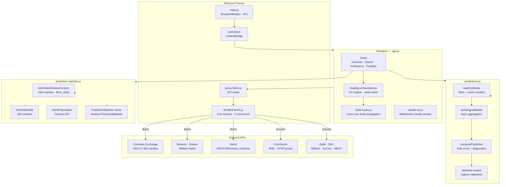

# System Architecture

## Component Map



---

## File Reference

| File | Role | Key exports |
|------|------|-------------|
| `main.js` | Electron main process, BrowserWindow, IPC | — |
| `preload.js` | contextBridge — exposes safe APIs to renderer | `window.electronAPI` |
| `app.js` | Main renderer — all views and UI logic | `renderPredictions()`, `buildKalshiDebugPanel()` |
| `predictions.js` | Prediction engine — fetch, compute, score | `window.PredictionEngine` |
| `prediction-markets.js` | Kalshi + Polymarket data cache | `window.PredictionMarkets` |
| `floating-orchestrator.js` | EV engine, trade intent, 3-tier logic | `window.FloatingOrchestrator` |
| `shell-router.js` | Cross-coin signal propagation | `window.ShellRouter` |
| `candle-ws.js` | WebSocket candle stream | `window.CandleWS` |
| `market-resolver.js` | Market metadata + contract resolution | `window.MarketResolver` |
| `proxy-fetch.js` | API routing (direct vs proxied) | `window.suppFetch` |
| `throttled-fetch.js` | Rate limiter, timeout, concurrency | `window.throttledFetch` |
| `cfm-engine.js` | CFM model core computations | `window.CFMEngine` |
| `orderbook.js` | Order book snapshot + imbalance | `window.OrderBook` |
| `cex-flow.js` | CEX trade flow aggregation | `window.CEXFlow` |
| `data-logger.js` | Signal + trade logging | `window.DataLogger` |
| `backtest-runner.js` | Full backtest orchestration | `window.BacktestRunner` |
| `social-sentiment.js` | X/Twitter sentiment feed | `window.SocialSentiment` |
| `chain-router.js` | On-chain data routing | `window.ChainRouter` |
| `wallet-cache.js` | Portfolio holdings cache | `window.WalletCache` |

---

## Data Flow — Prediction Cycle

```
1. candle-ws.js / loadCoinData()
   └─ fetch OHLCV from Coinbase (350 candles, 1-min)
   └─ fallback: Binance → Kraken
   └─ store in candleCache[sym]

2. prediction-markets.js / fetchKalshiSeriesForSym()
   └─ fetch open 15M markets for KXBTC15M etc
   └─ parse floor_strike, strike_type, yes_pct, close_time
   └─ store in PredictionMarkets.getCoin(sym).kalshi15m

3. predictions.js / buildSignalModel()
   └─ layer 1: benchmark (BTC dominance, macro)
   └─ layer 2: trend (EMA cross, price structure)
   └─ layer 3: momentum (RSI, ROC)
   └─ layer 4: microstructure (OBV, CVD, trade flow)
   └─ layer 5: timing (session, vol regime)
   └─ layer 6: derivatives (funding rate, OI)
   └─ layer 7: history (backtest regime fit)
   └─ shell-router packets injected here
   └─ orbital router applies per-coin weights
   └─ → modelScore (-1 to +1)

4. floating-orchestrator.js / translate()
   └─ modelProbUp = 0.5 + score × 0.40
   └─ EV = modelProbUp − kalshiYesPrice
   └─ edgeCents = EV × 100
   └─ Kelly fraction = EV / (winProb × netPayout)  capped 25%
   └─ 3-tier logic → Trade Intent
```

---

## Build Output

```
dist/
  WECRYPTO-PATCH-2.1.1.exe    ← portable single-file exe
  win-unpacked/               ← unpacked app dir (for debugging)
    WE--CRYPTO--BETA2.exe
    resources/
      app.asar                ← bundled renderer files
      app.asar.unpacked/
        we-crypto-proxy.exe   ← local proxy server
```
