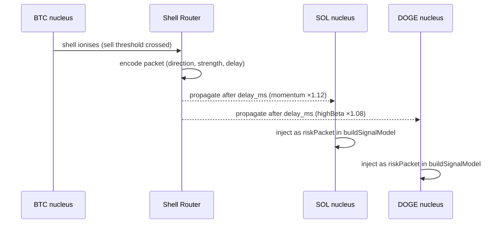
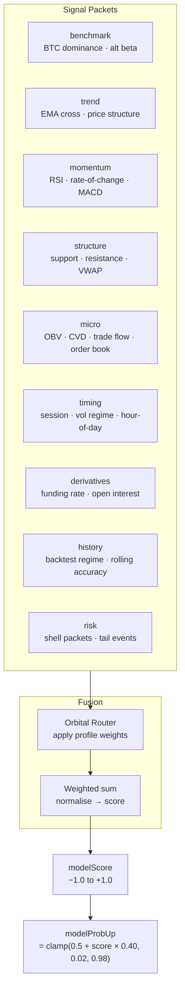

# Orbital Model

## Overview

WE|||CRYPTO models signal processing on subatomic orbital physics. Each coin is a **nucleus**. Signal packets are **electrons** — they carry energy (weight), occupy orbital shells (signal layers), and propagate between nuclei via the **Shell Router**.

---

## Orbital Profiles

Each coin is assigned one of three orbital profiles. The profile multiplies every signal packet's weight before fusion into the final score.

### `core` — BTC · ETH · BNB · XRP

Stable, high-mass nuclei. Benchmark signals dominate. Timing pressure is damped — these coins don't react impulsively.

| Weight Factor | Multiplier |
|---------------|-----------|
| Benchmark     | ×1.10 |
| Trend         | ×1.08 |
| Momentum      | ×0.96 |
| Structure     | ×1.04 |
| Micro         | ×0.86 |
| Timing        | ×0.78 |
| Derivatives   | ×0.92 |
| History       | ×1.06 |
| Risk          | ×0.92 |

### `momentum` — SOL · HYPE

Light, reactive nuclei. Timing and momentum dominate. Shell events hit harder (×1.12). These coins move fast on cross-coin propagation.

| Weight Factor | Multiplier |
|---------------|-----------|
| Benchmark     | ×0.98 |
| Trend         | ×1.02 |
| Momentum      | ×1.08 |
| Structure     | ×0.96 |
| Micro         | ×1.04 |
| Timing        | ×1.12 |
| Derivatives   | ×1.04 |
| History       | ×0.92 |
| Risk          | ×0.94 |

### `highBeta` — DOGE

Outermost shell. High volatility, low structural support. Risk packets amplified. Lower entry threshold — DOGE moves more unpredictably.

| Weight Factor | Multiplier |
|---------------|-----------|
| Benchmark     | ×0.98 |
| Trend         | ×1.02 |
| Momentum      | ×1.10 |
| Structure     | ×0.96 |
| Micro         | ×0.96 |
| Timing        | ×1.02 |
| Derivatives   | ×0.98 |
| History       | ×0.98 |
| Risk          | ×1.08 |

---

## Shell Router — Cross-Coin Propagation

When a coin's **shell wall** is confirmed (3 consecutive evaluation ticks breach the threshold), a signal packet is encoded and propagated to correlated coins. The receiving coin's orbital profile applies its timing/risk multiplier to the packet before it merges into the final score.

**Veto states:**
- `evaluating` — 1–2 of 3 ticks have triggered; orchestrator holds (`SHELL_EVAL`)
- `confirmed` — wall confirmed; orchestrator stands aside (`EARLY_EXIT`)

---

## Signal Layers

---

## Entry Thresholds by Coin

Coins have different conviction requirements before a signal is valid:

| Coin | Entry Threshold | Max Score | Min Agreement |
|------|-----------------|-----------|---------------|
| BTC  | 0.20 (1H) → 0.33 (15M) | 0.72 | 0.58 → 0.66 |
| ETH  | 0.22 (1H) → 0.33 (15M) | 0.70 | 0.58 → 0.66 |
| SOL  | 0.20 (1H) → 0.32 (15M) | 0.68 | 0.56 → 0.64 |
| XRP  | 0.20 (1H) → 0.32 (15M) | 0.68 | 0.56 → 0.62 |
| DOGE | 0.18 (1H) → 0.28 (15M) | 0.56 | 0.52 → 0.60 |
| BNB  | 0.20 (1H) → 0.33 (15M) | 0.58 | 0.54 → 0.64 |
| HYPE | 0.18 (1H) → 0.24 (15M) | 0.40 | 0.52 → 0.56 |

HYPE has the lowest max-score cap (0.40) — the model is deliberately conservative on a newer, less-liquid asset.
