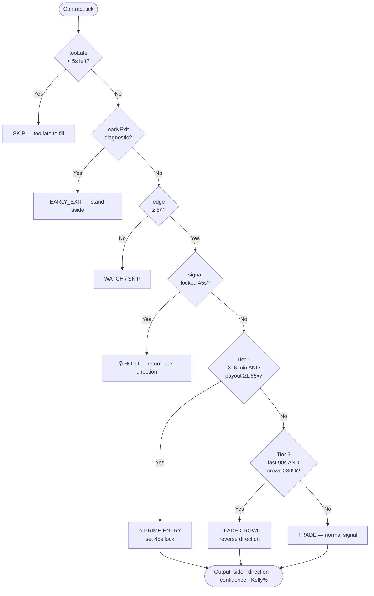

# Signal Engine

## EV Model

The orchestrator measures edge as the difference between the model's probability estimate and Kalshi's market price.

```
modelProbUp  = clamp(0.5 + modelScore × 0.40,  0.02, 0.98)
EV (YES)     = modelProbUp − kalshiYesPrice
EV (NO)      = kalshiYesPrice − (1 − modelProbUp)
edgeCents    = EV × 100
```

A trade requires **edgeCents ≥ 8** (8¢ per $1 contract). Below that, the signal is `WATCH` or `SKIP`.

### Kelly Criterion

Position sizing uses a Kelly fraction capped at 25%:

```
kellyFrac = EV / (winProb × netPayout)
kellyFrac = clamp(kellyFrac, 0, 0.25)
```

Where `netPayout = 1 − entryPrice`.

---

## 3-Tier Decision Logic



---

## Alignment States

| State | Condition | Confidence Boost |
|-------|-----------|-----------------|
| `ALIGNED` | modelBullish == kalshiBullish | Base |
| `DIVERGENT` | model ↑ but Kalshi heavy NO, or model ↓ but Kalshi heavy YES | Inversion flag |
| `MODEL_LEADS` | model active, Kalshi 45–55% (neutral) | Base |
| `MODEL_ONLY` | no Kalshi data available | Reduced |
| `KALSHI_ONLY` | model below threshold | Watch only |
| `SHELL_EVAL` | shell wall 1–2/3 confirmed | Hold |

**Confidence formula:**

```
mStr      = clamp(|modelScore|, 0, 1)
eBoost    = clamp(|edgeCents| / 60, 0, 0.25)
confidence = round(clamp((mStr + eBoost) × 75, 0, 99))
```

---

## Kalshi Data Fields

The orchestrator reads the following from `PredictionMarkets.getCoin(sym).kalshi15m`:

| Field | Source | Notes |
|-------|--------|-------|
| `probability` | `(yesAsk + yesBid) / 2` | Kalshi YES mid price |
| `targetPriceNum` | `floor_strike` (primary) | Contract strike price |
| `strikeDir` | `strike_type` field | `'above'` = YES if price ≥ strike |
| `closeTime` | `close_time` | Contract expiry ISO string |
| `ticker` | `ticker` | e.g. `KXBTC15MT75228` |
| `liquidity` | `liquidity_dollars` | Book depth in USD |
| `volume` | `volume_fp` | 24h volume |

**Kalshi API note (as of 2026-04):**  
`floor_price` is now always `""`. The strike is in `floor_strike` (raw number).  
`strike_type` changed from `'above'`/`'at_least'` → `'greater_or_equal'`.  
Both are handled in `prediction-markets.js`.

---

## Signal Lock

Prevents the orchestrator from flipping direction in the final minutes of a contract.

```js
const LOCK_MS = 45000;   // 45 seconds

// On each tick, if a lock exists for sym+closeTimeMs:
if (Date.now() - lock.ts < LOCK_MS) {
  return lock direction   // hold previous signal
}
// Otherwise compute fresh and update lock
```

Locks are keyed on `sym + closeTimeMs` so a new contract automatically gets a fresh evaluation.

---

## Crowd Fade

Applied only in the **last 90 seconds** of a contract when the crowd is heavily one-sided:

```js
const CROWD_FADE_PCT  = 0.80;   // 80% threshold
const CROWD_FADE_SECS = 90;

if (secsLeft <= 90) {
  if (kalshiYesPrice >= 0.80) direction = 'DOWN';  // fade heavy YES
  if (kalshiYesPrice <= 0.20) direction = 'UP';    // fade heavy NO
}
```

Rationale: extreme crowd bias in binary markets near expiry often prices in certainty that isn't there. The model fades the crowd rather than following it.
